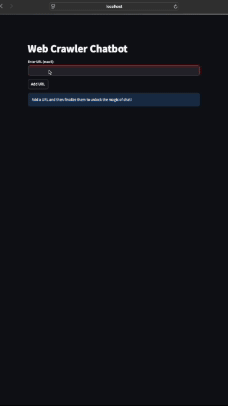
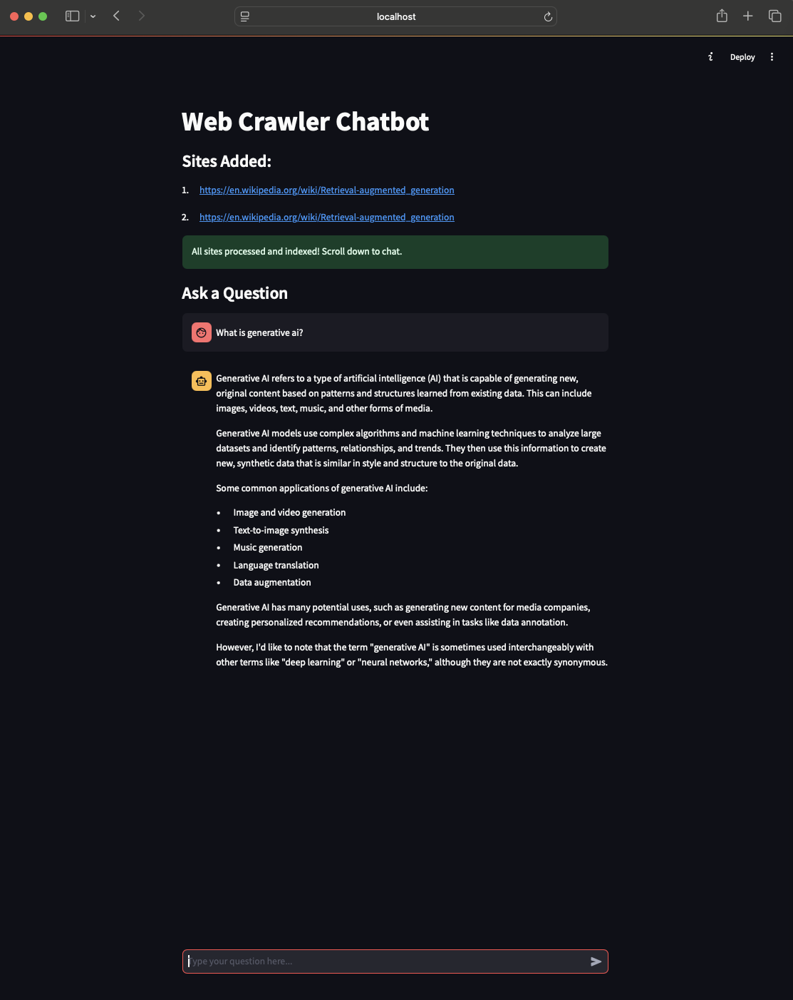
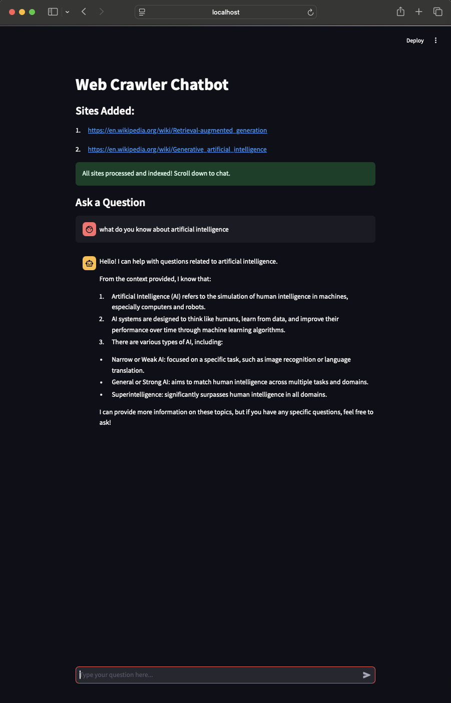
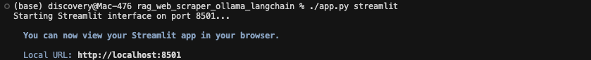
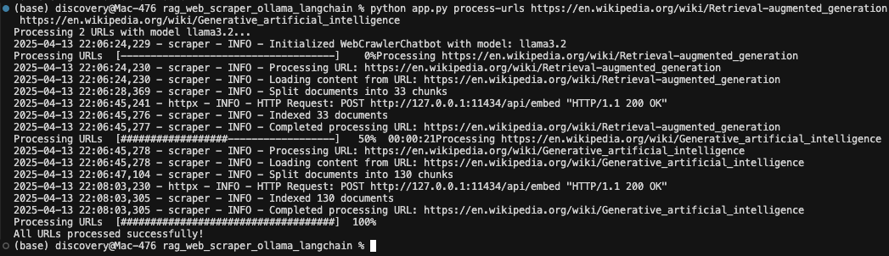
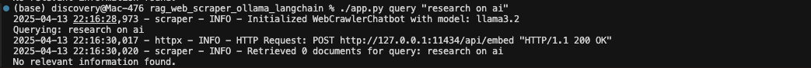

# RAG Web-Scraper Chatbot

A powerful web crawler chatbot that processes URLs, extracts content, and answers questions based on the indexed information using LLM technology.

Question and Answer Output:




| What is generative ai? | What do you know about artificial intelligence? |
|---|---|
|  |  |


## Features
- **URL Processing:** Extract & index content from multiple web pages.
- **Natural Language Querying:** Ask questions about the indexed content in natural language.
- **Streamlit Web Interface:** A user-friendly UI for adding URLs and asking questions.
- **Command-line Interface:** Flexible CLI with multiple commands for different use cases enabled by `typer`.
- **LLM Integration:** Powered by Ollama's LLM models (default: `llama3.2`).

## Project Structure
```
web-crawler-chatbot/
├── app.py                 # CLI(typer) / application (steamlit)
├── bin/
│   └── scraper.py         # main functionality
└── requirements.txt       # dependencies
```


## Installation

1. **Clone the Repository:**

   ```bash
   git clone https://github.com/yourusername/web-crawler-chatbot.git
   cd web-crawler-chatbot

2. **Install Dependencies:**
    ```bash
    pip install -r requirements.txt
    ```

3. **Setup Ollama and run it:**
   ```bash
   ollama pull llama3.2
    ```

## Usage

### Streamlit app interface

1. Launch the Streamlit Interface (interactive web-interface)
    ```bash
    python app.py streamlit
    ```

    or

    ```bash
    ./app.py streamlit
    ```

    Port defaults on 8501, to specify custom port using `--port` flag.

    Example: 

> Note: For all the tinkerers out there, here's an alternative method to run the tool entirely from the command line, as detailed in Steps 2 and 3.
    
### Command Line Interface

2. Extract and index content from specified URLs:
    ```bash
    python app.py process-urls https://en.wikipedia.org/wiki/Generative_artificial_intelligence https://en.wikipedia.org/wiki/Retrieval-augmented_generation
    ```
    or
    ```bash
    ./app.py process-urls https://en.wikipedia.org/wiki/Generative_artificial_intelligence https://en.wikipedia.org/wiki/Retrieval-augmented_generation
    ```

    Example: 

 3. Process and Query in One Command:
    ```bash
    python app.py query "What is Gen AI?" --urls https://en.wikipedia.org/wiki/Generative_artificial_intelligence https://en.wikipedia.org/wiki/Retrieval-augmented_generation
    ```
    or
    ```bash
    ./app.py query "What is Gen AI?" --urls https://en.wikipedia.org/wiki/Generative_artificial_intelligence https://en.wikipedia.org/wiki/Retrieval-augmented_generation
    ```

    Example: 

## How It Works
The process begins with URL processing where ***selenium, unstructure and langchain webloader loads web pages*** and extracts their content(all the elements for javascript & typescript) automatically. Once the content is retrieved, long documents are ***split into manageable chunks*** using a text splitting technique. These smaller segments are then ***converted into vector embeddings*** through Ollama, enabling the application to transform unstructured text into a structured form. The generated embeddings are ***stored in an in-memory vector store*** to allow for fast and efficient access during subsequent operations.

When a question is asked, a ***similarity search is performed to retrieve the most relevant content chunks*** from the vector store. The retrieved context, which closely matches the query, is then passed to a large language model. This model generates a response that is both contextually coherent and accurate based on the indexed information. This end-to-end pipeline ensures that the application delivers prompt and context-aware answers using a seamless integration of web scraping, text processing, and advanced LLM functionalities.

## Built With
1. **[Ollama](https://ollama.com//)** - High-performance AI model execution.
2. **[Llama-3.2](https://ollama.com/library/llama3.2)** - LLM trained on 1B parameters.
3. **[Streamlit](https://streamlit.io/)** - Web-based UI framework.

## Contact
Feel free to contribute or reach out!
1. **GitHub Issues** - Report bugs or request features.
2. **Pull Requests** - Improve the project with your contributions.
3. **Email** - [G-mail](unikill066@gmail.com)

## License
This project is licensed under the [MIT License](LICENSE).
